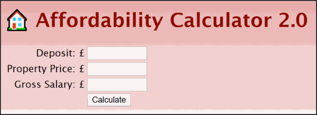

# Affordability Calculator (A Kubernetes Demo)

This demo demonstrates "bread and butter" Docker and Kubernetes capabilities:

* Docker
    * "Dockerising" an existing application
    * Running a Dockerised application locally
    * Pushing a dockerised application to a Container Registry
* Kubernetes
    * Ad-hoc scaling
    * Autoscaling
    * Self-Healing
    * Zero-downtime deployments
    * Rollbacks

# Case Study

ACME bank offers a mortgage affordability calculator to its customers and prospects. 


The mortgage app is stood up manually by an operations team without Ansible or any kind of automation:

```
cd version1
sudo python3 app.py
```

Source code:

* [version1/app.py](version1/app.py)
* [version2/app.py](version2/app.py)

The bank 
currently runs version 1 in production but a new Digital team is developing version 2 in parallel which is more colourful and allows including the prospect's salary as part of the calculation. 



The business fears that the migration to version 2 may cause downtime to customers who may be calculating their mortgage affordability on version 1.

A pair of consultants who both look like Chuck Norris' brothers have suggested to ACME bank to try Docker and Kubernetes... 


# Dockerising both Versions 


**(1) Set up two panels using TMUX, a tab-capable terminal or equivalent.**

**(2) Write a Dockerfile Manifest for each version of the app**

* [version1/Dockerfile](version1/Dockerfile)
* [version2/Dockerfile](version2/Dockerfile)

**(3) Build Container images for each App version**

```
cd version1
docker build -t affordability1-image .
cd ../version2
docker build -t affordability2-image .
```

* [version1/build.sh](version1/build.sh)
* [version2/build.sh](version2/build.sh)

**(4) Check out local images**

```
docker images
```

**(5) Test Containers locally**

```
# version 1
docker run -p 80:80 affordability1-image 
curl http://localhost/

# version 2
docker run -p 81:80 affordability2-image 
curl http://localhost/
```

* [version1/run.sh](version1/run.sh) - Mapped to Port 80 
* [version2/run.sh](version2/run.sh) - Mapped to Port 81

**(6) Exit containers by crashing them!**

```
curl http://localhost/crash
```

**(7) Push Containers to a Container Registry**

```
docker tag <IMAGE-NAME> <REGISTRY-URI>
docker push <REGISTRY-URI> 
```

* [version1/push_dockerhub.sh](version1/push_dockerhub.sh) - Push to Docker Hub
* [version1/push_gcr.sh](version1/push_gcr.sh) - Push to the Google Container Registry 
* [version2/push_dockerhub.sh](version2/push_dockerhub.sh) - Push to Docker Hub
* [version2/push_gcr.sh](version2/push_gcr.sh) - Push to the Google Container Registry 

**(8) Check out Containers on Docker Hub**

* [https://hub.docker.com/r/egarbarino/affordability1-image](https://hub.docker.com/r/egarbarino/affordability1-image)
* [https://hub.docker.com/r/egarbarino/affordability2-image](https://hub.docker.com/r/egarbarino/affordability2-image)

**(9) Pull and run containers on some other laptops!**

```
docker pull egarbarino/affordability1-image
```

# Prepare Both Versions to Run on Kubernetes

**(1) Write a Kubernetes Deployment manifest for each version:**

* [version1.yaml](vesion1.yaml) - Deployment manifest for version 1 
* [version2.yaml](vesion2.yaml) - Deployment manifest for version 2 

**(2) Write a Service manifest to expose de Deployment on a public load balancer:**

* [service_normal.yaml](service_normal.yaml) - Service manifest for both versions 

# Run Version 1 in Kubernetes

**(1) Set up two panels using TMUX, a tab-capable terminal or equivalent.**

* On Panel 1: Watch Pod activity by running `watch -n 1 kubectl get pods`
* On Panel 2: Leave free to type other commands

**(2) Apply Deployment manifest**

```
kubectl apply -f version1.yaml
```

**(3) Apply Service manifest**

```
kubectl apply -f service_normal.yaml
```

**(4) Wait for public IP address or hostname to be provisioned**

```
watch -n 1 kubectl get service 
```

**(5) Browse site on web browser (and set autofresh) and using curl too:**

```
curl http://IP
```

**(6) Check how each page refresh lands on a different Pod!**

# Chaos Engineering

**(1) Stamp Duty Increase Coming Up!**

The government is planning to increase the Stamp Duty tax next week and prospects are rushing to calculate their affordability and then get a mortgage from ACME bank! 

Fasten your seatbelts! Ad-hoc scaling coming up!

```
kubectl scale deployment/affordability --replicas=8
```

* [scaleup.sh](scaleup.sh)

**(2) Cowboy Coders!**

The application randomly crashes. ACME bank wonders what is the point of paying for SonarQube! :)

```
curl http://IP/crash
```

Kubernetes licks its wounds! Self-healing galore! 

**(3) Stamp Duty Too High! No one  wants mortgages anymore**

ACME bank is concerned that customers aren't buying mortgages anymore and the affordability calculator app is ranking up a huge bill for compute resources!

```
kubectl scale deployment/affordability --replicas=2
```

* [scaledown.sh](scaledown.sh)

**(4) Russian oligarchs buying London up!**

When ACME thought the market has gone quiet there is increased demand again! We can't rely on seasonal forecasting anymore! How can we manage our scaling like this?

```
kubectl autoscale deployment/affordability --min=1 --max=8 --cpu-percent=5
./flood.sh IP 
```

* [autoscale.sh](autoscale.sh)

**(5) Market quiet again**

Just clean up and let's get back to ad-hoc scaling...

```
kubectl delete hpa/affordability
kubectl scale deployment/affordability --replicas=5
```

# Zero-Downtime Deployments

ACME bank wants to migrate to version 2 of the affordability calculator but it does not want to incur a maintenance window which may result in the loss of business.

**(1) Set up a Load Balancer with Sticky Sessions**

* [service_affinity.yaml](service_affinity.yaml)

**(2) Create the Load Balancer**

```
kubectl apply -f service_affinity.yaml
```

**(3) Wait for the new public IP to be provisioned**

```
watch -n 1 kubectl get service
```

**(4) Point web browser to new IP**

* Access the site form your mobile phone!
* Refresh the page many times and make sure you always land on the same Pod

**(5) Watch for changes**

Note: Run this on a separate panel

```
while true; do curl -s http://IP | grep h1 ; sleep 1 ; done
```

Also make sure that autorefresh is active on the web browser!

**(6) Release the Kraken!**

```
kubectl apply -f version2.yaml
```

**(7) Oh no! Version 2 has a fatal bug!**

Roll back to the previous version!

```
kubectl rollout undo deploy/affordability
```

* [rollback.sh](rollback.sh)

